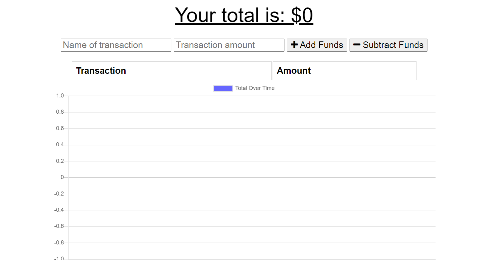
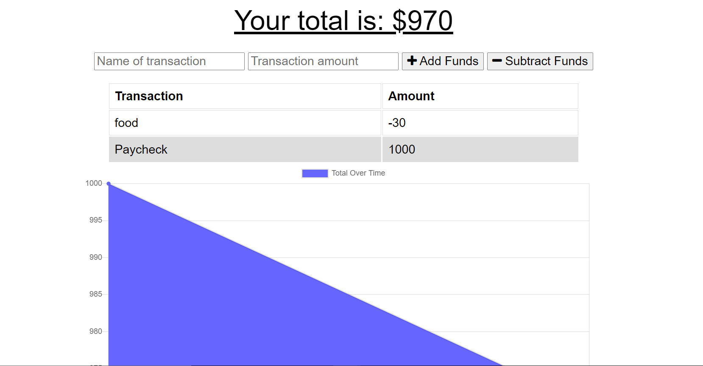
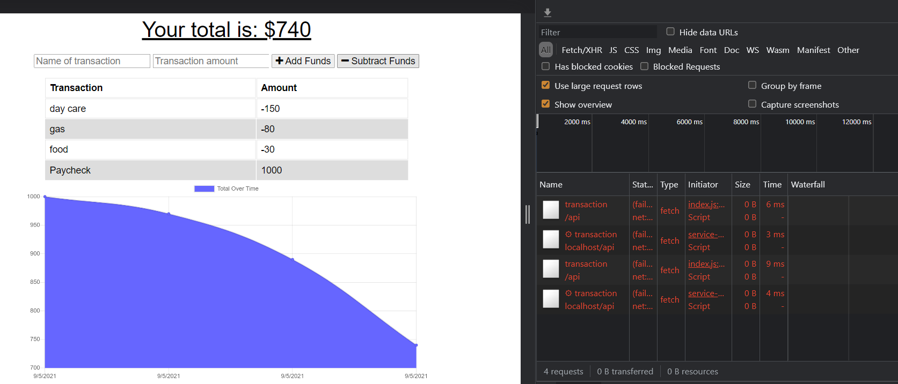
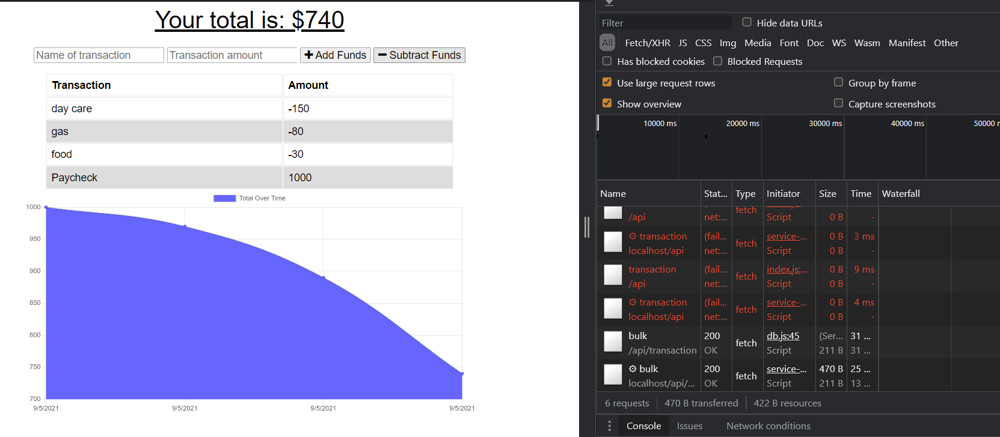
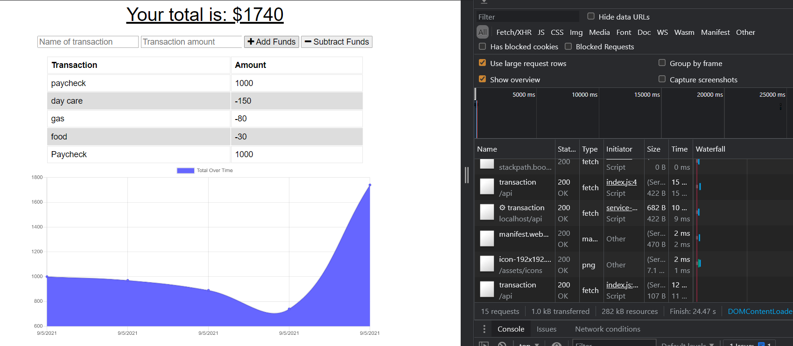

# PWA-Budget-Trackers
PWA (Progressive Web Application) is an application that allows users to be able to add expenses and deposits to their budget with or without an internet connection.

# Table of Contents
* [User Story ](#User_Story)
* [Description](#Description)
* [Installation](#Installation)
* [Technologie Used](#Technologie)
* [Screenshots](#Screenshots) 
* [Deployed](###Deployed_Link)
* [Contact](#Contact)
# User Story 
As a traveller, I sometimes travel to areas that do not have any internet connection.  I need an application that allows me to document all my expense.

# Description
This application allows a user to document any expense with and without internet connection.

# Installation 
1. Fork the repository from Github to your profile.
2. Install the required dependencies to your clonded directory `npm install` or `npm i`.
3. Make sure following dependencies is installed:
 - compression
 - express
 - gitignore
 - lite-server
 - mongoose
 - morgan

# Technologie Used
| Frontend      |    | Backend |
| ----------- | --- | ----------- |
| HTML      | | Node.js       |
| CSS   | | MongoDB         |
| Bootstrap   | | Express        |
| Javascript   | |Heroku (Deployment )      |
| jQuery   |   

# Screenshots
### Homepage

### Transaction

### Offline

### Online

### Reload

### Deployed Link 
[Github](https://github.com/anhcu/PWA-Budget-Trackers)
 
[Herokuapp](https://pwa-traveler-tracker.herokuapp.com/)

# Contact
If you have any questions or would like to reach out please contact me at [LinkedIn](https://www.linkedin.com/in/anh-cu/).